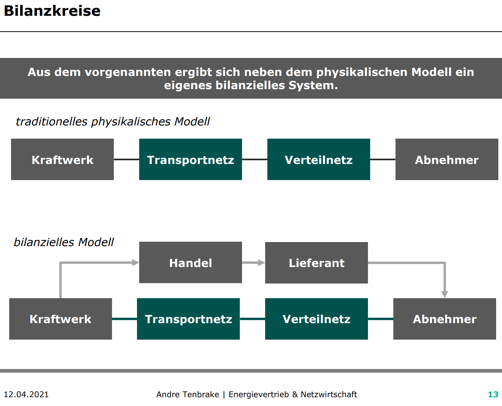

# Warum wurde liberalisiert und welche Folgen hatte dies für die Erzeuger und Verbraucher? 
Früher hatten die **Erzeuger Monopolstellung**. Dadurch konnten sie die Preise festsetzen.

Die Liberalisierung meint die Einführung eines Wettbewerbs, Abbau von Zutrittsbarrieren und weniger politische Eingriffe. Verbraucher können ihren Anbieter frei wählen und haben dadurch tendenziell niedrigere Strompreise.

Hinweis: Die Liberalisierung betrifft nicht die Netze. Aufgrund der hohen Investitionskosten bleibt hier das Monopol bestehen.

F 1 - 6

# Was sind Ziele des Unbundligs, wie werden diese umgesetzt und warum gibt es die de-Minimis-Regelung?
Ziel ist die Trennung des Netzes vom Vertrieb.

| Unbundlingform | Größe |
| Buchhalterisch | jedes EVU |
| Informatoisch | jedes EVU |
| Organisatorisch | jedes EVU |
| Gesellschaftsrechtlich | ab 100.000 angeschlossenen Zählpunkten |
| Eigentumsrechtlich | für Übertragungsnetzbetreiber |

Die **De-minimis-Beihilfe** hilft kleinen Energieversorgungsunternehmen (EVU). Diese haben aufgrund ihrer Größe nicht die Kapazität alle Unbundlingstufen umzusetzen. 

F 1 - 7

# Wir unterscheiden zwischen dem physischen Modell und bilanziellen Modell, erläutern Sie die Notwendigkeit und den Unterschied. 
- Einspeisung wird pauschal abgerechnet
- Netzentgelte nur für Beschaffung (Stromfluss von Höchstspannungnetz -> Abnehmer)

F 1 - 11ff.

# Worin besteht der Unterscheid zwischen Ausgleichsenergie und Regelenergie?
**Ausgleichsenergie**
- Hin und Herschieben von Energiemengen zwischen den Bilanzkreisen
- finanzielle/buchhalterisch

**Regelenergie**
- Tatsächlicher Eingriff -> Es muss mehr/weniger Strom erzeugt werden.

F 1 - 18

# Was ist ein Bilanzkreis?
Antwort nach Borchert:
- Ein Energiekonto
- Marktlokationen (Einspeisung und Entnahme) wird diesem zugeordnet
- Ziel: Einspeisung = Entnahme (bilanzieller Ausgleich durch Handelsgeschäfte)

Antwort nach Folien
- Virtuelles Versorgungsgebiet
- Bündelung von Einspeisung und Abnehmer
- Das für den Bilanzkreis verantwortliche Unternehmen wird Bilanzkreisverantwortlicher genannt.
- Ziel: Erzeugung = Verbrauch

F 1 - 14

# Worin unterscheiden sich die Zuständigkeiten von Verteilnetzbetreiber und Übertragungsnetzbetreiber?
**Übertragungsnetzbetreiber**
- Betreibt eine der 4 Regelzonen
- Ist für die Systemsicherheit verantwortlich
- Ist gleichzeitig Bilanzkreiskoordinator
- Aufgaben
  - Netzführung, -instandhaltung, -planung und -ausbau
  - Regulierungsmanagement 
  - Messstellenbetrieb
  - Netz- und Messzugangsmanagement
  - Energiemengenbilanzierung
  - Netzabrechnung
  - erweitertes Berichtswesen

**Verteilnetzbetreiber**
- Betreibt eins der aktuell 883 Verteilnetze
- unterstützt das Bilanzkreissystem durch Zuordnung von Kunden zu Lieferanten und Bilanzkreisen
- Aufbereitung und Lieferung von Daten an LF, BKV und BIKO.
- Aufgaben
  - Netzführung, -instandhaltung, -planung und -ausbau
  - Regulierungsmanagement, 
  - Messstellenbetrieb
  - Netz- und Messzugangsmanagement
  - Energiemengenbilanzierung
  - Netzabrechnung
  - erweitertes Berichtswesen

#  Welche Folgen kann es haben, wenn ein Differenzbilanzkreis systematisch große Fehlmengen aufweist und nicht bewirtschaftet wird? 
**Differenzbilanzkreise** werden von Netzbetreibern geführt und bewirtschaftet. Sie beinhalten die Fehlmengen zwischen Prognose und Verbrauch von mit SLP bilanzierten Kunden für alle 15 Minuten. Der Netzbetreiber kann anhand dessen seine SLP anpassen.

Wenn der nicht richtig bewirtschaftet wird, kann das folgende Folgen haben:
- Instabilität der Netzfrequenz
- Mehr Regelenergie
- Bezahlen von Bußgeldern

F 1 - 45

# Wer ist finanziell verantwortlich für den Ausgleich zwischen bilanziell und gemessenen Energiemengen von SLP bilanzierten Marktlokationen?
Der Netzbetreiber. Abgerechnet wird dies im Nachgang über eine Mehr-/Mindermengen Abrechnung.

# Erläutern Sie wie sich Smart Meter auf die Bilanzierung von Haushaltskunden auswirken können.
Positiv. Bisher werden Haushaltskunden mit verallgemeinerten SLPs prognoszitiert. Mit Smart Meter können individuellere Lastprofile angelegt werden, da diese Zählerstände in einer deutlich höheren Frequenz beschaffen. (Fernauslesbar und 15 Minuten Takt) 

# Ist eine Konzession eine notwendige Voraussetzung für einen Netzbetreiber?
Ja, ist sie. Nur mit einer Konzession darf der Netzbetreiber das Netz betreiben und daraus eine Wertschöpfung erzielen.

Konzessionsverträge stellen die rechtliche Grundlage für den Netzbetreiber dar, sie determinieren aber nicht zwangsläufig wie das Unternehmen entlang der Wertschöpfungsstufen organisiert ist.

F 2 - 8

# Was ist das Ziel eines Netzbetreibers?
Oberstes ziel des Netzbetreibers ist die sicher und kostengünstige Versorgung seiner diskriminierungsfrei angeschlossenen Kunden. Daraus ergibt sich folgendes Zieldreiecke in der Unternehmensstruktur. (Privates Unternehmen. Will Gewinn erzielen)

F 2 - 9

# Warum gibt es unterschiedliche Kooperationsmodelle und mit welchem Ziel werden diese angewandt?
Diese haben Maßgeblichen Einfluss auf die Berichtspflichten im Rahmen der Regulierung.

# Wo liegt der Unterschied zwischen einer großer und einer kleiner Netzgesellschaft?
Je größer die Netzgesellschaft, desto mehr Personal und eigenes KnowHow bringt diese mit. Dadurch kann diese mehr Aufgaben (z.B. Netzbewirtschaftung) übernehmen. Kleinere Netzgesellschaften haben diese Kompetenz nicht und müssen deshalb andere Netzgesellschaften/EVUs mit dem Netzbetrieb beauftragen.

# Warum wird zunehmend rekommunalisiert?
Wirtschaftlichkeit  (Städte erkennen das immer mehr als Einnahmequelle. Konzessionsverträge werden nur ausgestellt, wenn Stadt beteiligt ist.)

Soll angeblich noch weitere Vorteile haben.
- Bürgernähe
- Bessere Zusammenarbeit mit Kommunne
- Regelmäßige Informationen an Verwaltung und Politik

F 2 - 15

# Wie würden Sie die Marktkommunikation einem ahnungslosen Dritten beschreiben? 
Die BNetzA legt die standardisierten Marktprozesse in der Energiewirtschaft fest.
Es gibt zahlreiche Prozesse für den Austausch unter den verschiedenen Marktrollen.

# Warum ist diese so wichtig für ein funktionierendes Gesamtsystem?
Energiewirtschaft ist ein Massengeschäft. Es müssen viele verschiedene Unternehmen/Marktakteure zusammenarbeiten, damit der ganze Bumms funktioniert.

Dafür ist es wichtig einen elektronischen standardisierten Weg zur Datenübermittlung zu haben. Dies ist die Marktkommunikation.

# Wie hat sich die Marktkommunikation in der Vergangenheit entwickelt?
Rasant.

BNetzA hat viele dumme Einfälle. Beispiel Lieferscheine. Mehrarbeit Viel, Mehrwert Null.

# Welche Herausforderungen begegnet die Marktkommunikation in Zukunft?
Mako 2020 - oder mittlerweile eher Mako 2030. 

Hmm womöglich
- Smart Meter - deutlich mehr Messwerte. Wo bisher 1x pro Jahr abgelesen wurde jetzt in 15 Minuten
